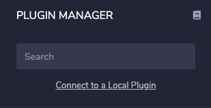
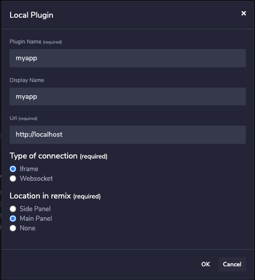

# Getting started

## Basic concepts of a simple Remix plugin

A remix plugin in its simplest form is a webapp running in an iFrame on the Remix IDE.

To interact with Remix you will need to use the Remix plugin code. This will provide:
- making calls to Remix, for example to load a file
- listen to events from Remix, for example when a user has compiled a sol file
- loading the currently active CSS theme in your plugin
- interacting with other plugins
- helper functions like loading content

You can use any framework you like, React, Webpack, Angular ...

## Loading the library

The library you have to use for an iFrame plugin is called plugin-webview.

Install the library with your package manager a described in <a href='https://github.com/ethereum/remix-plugin/tree/master/packages/plugin/webview' target=_blank>plugin-webview</a>.

Using the library you create an instance of the plugin *client*, you can have your own class extend the plugin or just instanciate a plugin client.

The client can listen to events and call methods.

## The onload event

The onload event is the signal in your app communication is setup with Remix. In case you don't see that event happening something is wrong.
You should check the console to find out.

```
client.onload(async () => {
})
```

## Bootstrap CSS

When the client is loaded Remix will provide your iFrame with a theme, the current theme choosen by the user.

If that onload event doesn't happen, the theme won't be loaded and neither will the client be ready to interact with
Remix.

**You should not load your own bootstrap css!** It is not necessary. When using bootstrap JS functions however, you should load them in your codebase.

Your styling should always directed towards compliance with the look & feel of Remix. Use the standard buttons, like primary, secondary, success, danger and so on.
They will be styled by the Remix CSS that is loaded on your iFrame. You should follow the general guidelines outlined in this manual.


## The plugin API

### Files

By simply calling the fileManager method on the client you can interact with the Remix filesystem.

Read about those file methods and events here <a href='https://github.com/ethereum/remix-plugin/blob/master/packages/api/doc/file-system.md' target=_blank>https://github.com/ethereum/remix-plugin/blob/master/packages/api/doc/file-system.md</a>.

### Importing content

You can have Remix handle importing content for you. It can load data from various sources and also write it to file: <a href='https://github.com/ethereum/remix-plugin/blob/master/packages/api/doc/content-import.md' target=_blank>https://github.com/ethereum/remix-plugin/blob/master/packages/api/doc/content-import.md</a>

### The solidity compiler

You can interact with the solidity compiler. Follow these methods <a href='https://github.com/ethereum/remix-plugin/blob/master/packages/api/doc/solidity.md' target=_blank>https://github.com/ethereum/remix-plugin/blob/master/packages/api/doc/solidity.md</a> 

### Exposing methods

You can expose methods in your app to other plugins or call methods on other plugins. It is described in <a href='https://github.com/ethereum/remix-plugin/tree/master/packages/plugin/webview' target=_blank>plugin-webview</a>.

**You should include those methods in your profile.json which you create to <a href='publishing_your_plugin.html'>publish your plugin.</a>**

### More API

Check out <a href='https://github.com/ethereum/remix-plugin/tree/master/packages/api/doc' target=_blank>these docs</a> to find out what more you can do with the plugin.
These include networking, unit testing and much more.


## Installing the plugin locally 

When you've developed your app you can run locally and install it in Remix.

1. Click on the plugin icon
   

1. Click on add local plugin
   


You can load your plugin either in the main panel, or on the side.

1. Specify your plugin URL
   



