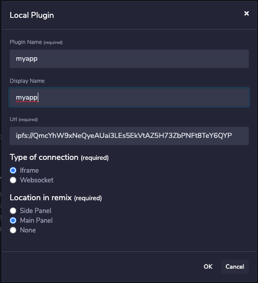

# Publishing your plugin

The repo <a href='https://github.com/ethereum/remix-plugins-directory'>ethereum/plugins-directory</a> holds a directory called plugins.
Each plugin has its own directory.

## Profile.json

To publish a plugin you need to create a pull request there that publishes a JSON profile.json file describing your plugin.

Mandatory fields are:
> * name
> * displayName
> * version
> * URL
> * icon
> * location
> * documentation

```
{
  "name": "<name of the plugin>",
  "displayName": "<display name of the plugin>",
  "methods": [], // list of methods that the plugin is making available to other plugins
  "version": "1.0.0-alpha", // semver version
  "url": "<URL>", // can be an https or ipfs URL - ipfs://<ipfs_hash>
  "description": "<description>",
  "icon": "<link to image>", // https link to image or BASE64 value
  "location": "<panel where the plugin should be rendered>", // can be sidePanel, mainPanel or hidden
  "documentation":"<URL>"
}
```

When the plugin is approved it will be published to the plugin directory in Remix.

## Profile tools & Hosting

You can host your plugin anywhere you want. We provide tools to upload your plugin to our own IPFS gateway.

This tool will guide you through the process. You can have it create the profile file directly into the plugins directory so you can push your PR to us.

```
git clone https://github.com/ethereum/remix-plugins-directory
cd remix-plugins-directory/tools
npm i
node ipfs-upload/bin/upload-remix-plugin
```

You will get an IPFS link to your app you can copy/paste to Remix to test it.

## Testing your app in IPFS

Before you push your PR you should always test your build. Running locally or on IPFS can be different, depending how you setup your app.

1. Click on the plugin icon
   

1. Click on add local plugin
   


You can load your plugin either in the main panel, or on the side.

1. Specify your plugin URL, for example ipfs://xxxxx
   



