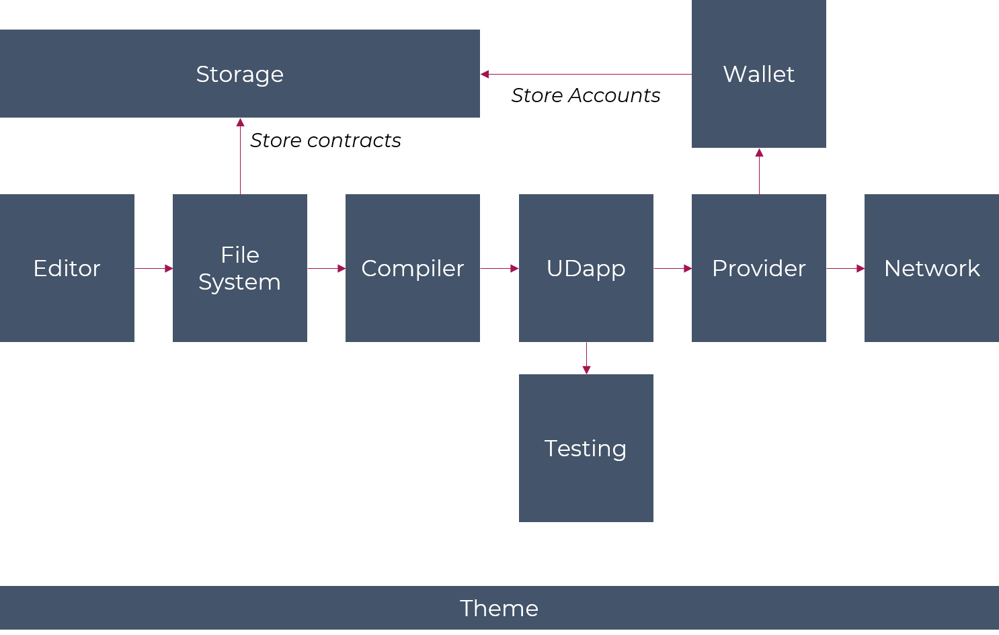

# Common API

This folder describes interfaces for common plugin api.

## Status

- **Names**: Draft
- **Description**: Draft
- **Interfaces**: Draft

## Example of Dapps

### IDE
Exemple of architecture for an Ethereum IDE

